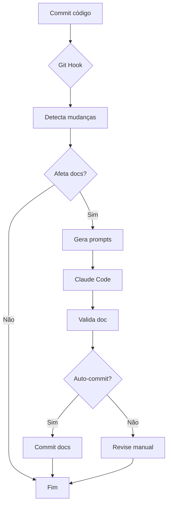

# Update Docs Skill

**Trigger:** Mudanças em código core (api, services, models, frontend)

**Objetivo:** Manter documentação sincronizada com código.

## Uso

```bash
# Automático (via git hook)
git commit -m "Add endpoint"
# Hook pergunta se quer atualizar docs

# Manual
./scripts/auto-update-docs.sh --last-commit

# Via Makefile
make update-docs
```

## O que faz

**Router mudou** → Atualiza `docs/api.md`
**Service mudou** → Atualiza `docs/arquitetura.md`
**Model mudou** → Atualiza `docs/database_model.md`
**Frontend mudou** → Atualiza `docs/arquitetura_front.md`

## Templates de Prompts

Os templates abaixo são usados pelo script `auto-update-docs.sh` para gerar prompts para Claude Code.

### API Docs Update

```
Atualizar docs/api.md para refletir mudanças no router '{router_name}' ({router_file}).

Endpoints encontrados:
{endpoints_list}

Para cada endpoint novo/modificado:
1. Adicione/atualize descrição do que faz
2. Liste parâmetros (query, path, body) com tipos
3. Exemplo de request (curl ou httpie)
4. Exemplo de response (JSON)
5. Códigos de status possíveis (200, 201, 404, etc.)

IMPORTANTE:
- Mantenha formato existente em docs/api.md
- NÃO remova outros endpoints já documentados
- Apenas adicione/atualize seção do router '{router_name}'
- Use exemplos reais baseados nos schemas Pydantic do router
```

### Architecture Docs Update

```
Atualizar docs/arquitetura.md para refletir mudanças no service '{service_class}' ({service_file}).

Verifique e atualize:
1. O service está listado na seção 'Service Layer'?
2. Responsabilidades estão documentadas corretamente?
3. Dependências (repositories, infra clients) estão corretas?
4. Fluxo de dados está atualizado?

Se necessário:
- Atualize diagramas ASCII-art mostrando fluxo
- Adicione service à tabela de services
- Documente novos métodos principais públicos

IMPORTANTE:
- Preserve estrutura e conteúdo existente
- Apenas adicione/atualize seção relacionada a '{service_class}'
- Mantenha consistência com outros services documentados
```

### Database Model Docs Update

```
Atualizar docs/database_model.md para refletir mudanças no model ORM ({model_file}).

Classes detectadas: {classes}

Para cada tabela:
1. Atualize schema (colunas, tipos, constraints)
2. Documente relacionamentos (FK, One-to-Many, Many-to-Many)
3. Adicione índices se houver
4. Marque campos obrigatórios (NOT NULL) vs opcionais

IMPORTANTE:
- Use schema REAL do banco (analise o código SQLAlchemy Column())
- Mantenha formato de tabela markdown existente
- NÃO remova outras tabelas já documentadas
- Se campos foram removidos do código, remova da doc também
```

### Frontend Docs Update (Pages)

```
Atualizar docs/arquitetura_front.md para refletir mudanças na página '{page_name}' ({page_file}).

Página: {page_name}
Rota inferida: {route}

Verifique e atualize:
1. Tabela de rotas (path, componente, descrição)
2. Componentes principais usados pela página
3. Hooks utilizados (useQuery, useMutation, custom hooks)
4. Fluxo de dados (API calls, state management)

IMPORTANTE:
- Mantenha formato existente
- NÃO remova outras páginas
- Se for nova página, adicione descrição clara do propósito
```

### Frontend Docs Update (Hooks)

```
Atualizar docs/arquitetura_front.md para refletir mudanças no hook '{hook_name}' ({hook_file}).

Hook: {hook_name}

Adicione/atualize na seção 'Custom Hooks':
1. Nome e propósito do hook
2. Parâmetros aceitos (com tipos TypeScript)
3. Retorno (com tipos TypeScript)
4. Exemplo de uso em componente

IMPORTANTE:
- Mantenha lista de hooks organizada
- Use formato consistente com hooks existentes
```

## Regras

- SEMPRE preserve conteúdo existente
- Apenas adicione/atualize seções relacionadas à mudança
- Use formato markdown consistente
- Mantenha exemplos de código atualizados
- Se código foi removido, remova da doc também
- NÃO documente métodos privados (com `_`)

## Validação

Após atualização, o script valida:

1. **Arquivo modificado:** Doc foi realmente atualizada
2. **Tamanho razoável:** Não deletou conteúdo por engano
3. **Sintaxe markdown:** `markdownlint` (se disponível)

```bash
# Verifica sintaxe markdown
markdownlint docs/**/*.md

# Verifica que arquivo foi modificado
git diff docs/
```

## Fluxo Completo



## Documentos Atualizados

**Backend:**
- ✅ `docs/api.md` - Quando routers mudam
- ✅ `docs/arquitetura.md` - Quando services mudam
- ✅ `docs/database_model.md` - Quando models ORM mudam

**Frontend:**
- ✅ `docs/arquitetura_front.md` - Quando pages/hooks mudam

**NÃO atualizados automaticamente:**
- ❌ `CLAUDE.md` - Regras e convenções (manual)
- ❌ `docs/TESTING.md` - Guia de testes (manual)
- ❌ `docs/cli.md` - CLI docs (manual, poderia ser futuro)

**Razão:** `CLAUDE.md` define **regras**, não **estado**. Docs em `docs/` refletem **inventário atual** do código.

## Exemplos de Uso

### Exemplo 1: Novo Endpoint

```bash
# 1. Adiciona endpoint em router
vim src/synth_lab/api/routers/research.py

# 2. Commit
git add src/synth_lab/api/routers/research.py
git commit -m "feat: add GET /research/batch endpoint"

# 3. Hook detecta mudança
📚 SUGESTÃO: Atualizar documentação
...
Escolha (1/2/3): 1

# 4. Script gera prompt e chama Claude Code
📡 Routers modificados detectados
📝 Prompts gerados: 1

Prompt 1/1 - Tipo: api
Doc: docs/api.md
...

Executar este prompt com Claude Code? (y/n) y

🤖 Executando Claude Code...
✅ Claude Code executado com sucesso
📖 Validando atualização de doc...
✅ docs/api.md atualizado com sucesso

# 5. Revisa e commita
git diff docs/api.md
git commit -m "docs: add GET /research/batch to API docs"
```

### Exemplo 2: Novo Service

```bash
# 1. Cria novo service
vim src/synth_lab/services/email_service.py

# 2. Commit
git commit -m "feat: add email notification service"

# 3. Hook sugere atualizar docs
⚙️  Services modificados detectados
...

# 4. Claude Code atualiza docs/arquitetura.md
# Adiciona EmailService na seção de services
# Documenta responsabilidades
# Atualiza diagrama de camadas
```

### Exemplo 3: Dry Run (Vê prompts sem executar)

```bash
./scripts/auto-update-docs.sh --last-commit --dry-run

# Output:
📚 Auto-Update Docs com Claude Code

Arquivos modificados:
  - src/synth_lab/api/routers/synthetics.py

🔍 Analisando mudanças...
📡 Routers modificados detectados

📝 Prompts gerados: 1

════════════════════════════════════════
Prompt 1/1 - Tipo: api
Doc: docs/api.md
════════════════════════════════════════

Atualizar docs/api.md para refletir mudanças no router 'synthetics'...
[prompt completo]

[DRY-RUN] Pulando execução
```

## Guia Completo

Ver [docs/DOCUMENTATION_MAINTENANCE.md](../../docs/DOCUMENTATION_MAINTENANCE.md) para:
- Plano completo de implementação
- Ideias avançadas (metadata, coverage metrics)
- GitHub Actions workflows
- Troubleshooting
