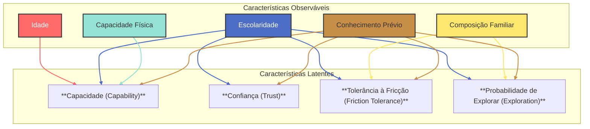
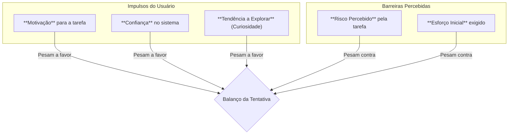
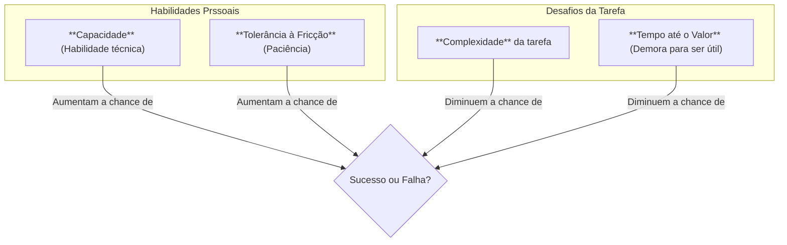

# Entendendo a Análise Quantitativa: Como Prever o Comportamento de Usuários

Olá! Para criar produtos digitais melhores, precisamos entender como as pessoas reagiriam a novas funcionalidades antes mesmo de as lançarmos. Para isso, criamos perfis de usuários simulados, que chamamos de **Synths**. Cada Synth representa um tipo de usuário real, com suas próprias características e habilidades.

Nosso objetivo é prever se uma nova função em um aplicativo será fácil e útil, ou se gerará dificuldade e frustração. Para fazer isso, usamos uma técnica de modelagem chamada **Simulação de Monte Carlo**.

Parece complicado? Na verdade, a lógica é bem direta. É como se observássemos milhares de usuários virtuais interagindo com a nova funcionalidade para analisar os resultados mais prováveis.

Vamos começar pelo princípio: como construímos esses perfis de usuários?

## 1. Construindo um Perfil de Usuário (Synth)

Tudo começa com as características básicas que definem um usuário. Essas informações são dados que podemos observar ou coletar.

Essas são as **Variáveis Observáveis**:

*   **Idade:** Quantos anos o usuário tem.
*   **Escolaridade:** O nível de educação formal, que pode influenciar a familiaridade com tecnologia.
*   **Composição Familiar:** Com quem a pessoa mora, o que pode impactar seu tempo e disponibilidade.
*   **Capacidade Física (PcD):** Se o usuário possui alguma deficiência (visual, auditiva, motora) que possa influenciar a interação com o dispositivo.
*   **Conhecimento Prévio:** A experiência que ele já tem com ferramentas digitais parecidas.

## 2. Derivando Características Comportamentais (Variáveis Latentes)

Com base nos dados observáveis, podemos inferir algumas características sobre como esse usuário provavelmente se comporta. São traços que não vemos diretamente, mas que são cruciais para entender suas ações.

Chamamos isso de **Variáveis Latentes**.

Vamos entender esses traços comportamentais:

*   **Capacidade (Capability):** Refere-se à **habilidade** geral do usuário para usar tecnologia. É uma combinação de sua escolaridade, capacidade física e conhecimento prévio.
*   **Confiança (Trust):** Mede o quanto o usuário **acredita** que sistemas digitais são seguros e confiáveis. Alguém com mais experiência tende a ter mais `Confiança`.
*   **Tolerância à Fricção (Friction Tolerance):** É a **paciência** que o usuário tem ao encontrar obstáculos ou dificuldades. Alguém com mais tempo livre pode ter mais `Tolerância à Fricção`.
*   **Probabilidade de Explorar (Exploration):** É a tendência de um usuário em **descobrir** novas funcionalidades por conta própria.

## 3. Avaliando a Nova Funcionalidade (Scorecard)

Cada nova funcionalidade que queremos testar também tem suas próprias características, que nós definimos em uma avaliação chamada **Scorecard**.

*   **Risco Percebido:** A percepção do usuário de que algo pode dar errado. (Ex: "E se eu perder meus dados ao usar isso?")
*   **Esforço Inicial:** A dificuldade para começar a usar a função. (Ex: "Preciso preencher um longo cadastro inicial?")
*   **Complexidade:** O quão difícil é entender e operar a função. (Ex: "A interface tem muitas opções e não é intuitiva.")
*   **Tempo até o Valor:** O tempo que leva para o usuário obter um benefício real. (Ex: "Preciso usar por 5 minutos até ver alguma utilidade?")

## 4. A Probabilidade de Tentativa: Impulsos vs. Barreiras

Com o perfil do usuário e as características da funcionalidade definidos, a primeira pergunta é: o usuário **tentará** usar a função ou irá ignorá-la?

A resposta depende de um balanço entre os **impulsos do usuário** e as **barreiras percebidas**.

O modelo coloca esses fatores em uma balança. De um lado, os impulsos do usuário (motivação, confiança, curiosidade) o empurram para a ação. Do outro, as barreiras da funcionalidade (risco, esforço) o freiam. O resultado desse balanço determina a probabilidade de ele tentar.

## 5. A Probabilidade de Sucesso: Habilidades vs. Desafios

Uma vez que o usuário decide tentar, o sucesso dependerá do confronto entre suas **habilidades pessoais** e os **desafios da tarefa**.

Novamente, é uma questão de balanço. Se as habilidades do usuário (sua capacidade técnica e sua paciência) superarem os desafios da funcionalidade (sua complexidade e demora para gerar valor), a probabilidade de sucesso é alta. Caso contrário, a chance de falha aumenta.

---

## A Simulação de Monte Carlo

A Simulação de Monte Carlo é a técnica que usamos para repetir esse processo em larga escala e obter resultados estatisticamente relevantes.

1.  Geramos **centenas perfis** de usuários (Synths) diferentes.
2.  Para cada perfil, simulamos a interação com a funcionalidade **100 vezes** para considerar variações e ruídos.
3.  Ao final, agregamos os resultados de todas as simulações:
    *   **Não Tentaram:** A porcentagem de vezes que os usuários não iniciaram o uso da função.
    *   **Falharam:** A porcentagem de vezes que os usuários tentaram, mas não conseguiram concluir.
    *   **Sucesso:** A porcentagem de vezes que os usuários tentaram e tiveram êxito.

Com esses dados, podemos gerar insights como: "70% dos usuários tiveram sucesso, mas 20% que falharam eram predominantemente usuários com mais idade e baixa capacidade física." Esta análise nos ajuda a entender com precisão onde nosso aplicativo precisa melhorar para se tornar mais acessível e eficiente para todos.