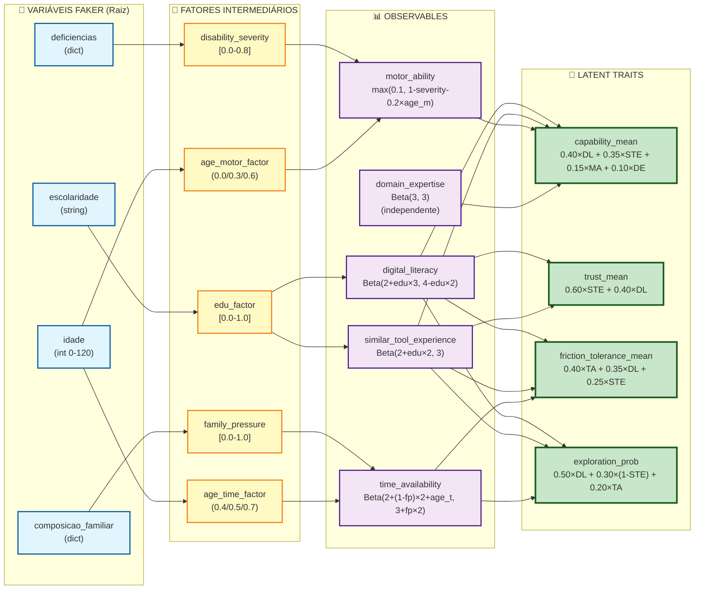

# Diagrama de Dependências: Variáveis Faker → Latent Traits

Este diagrama mostra como os **latent traits** são derivados das variáveis raiz geradas pelo Faker, passando por fatores intermediários e observables.

---

## Legenda 

- 🎲 **Variáveis Faker** (raiz) - Geradas com distribuições IBGE
- 🔧 **Fatores Intermediários** - Transformações das variáveis Faker
- 📊 **Observables** - Atributos observáveis (distribuições Beta ajustadas)
- 🎯 **Latent Traits** - Traços latentes (combinações lineares)

---

## Diagrama Completo



---

## Tabela de Dependências por Latent Trait

### 1. capability_mean

| Observable | Caminhos Faker (Variáveis → Fatores) | Peso no Latent Trait |
|------------|--------------------------------------|----------------------|
| **digital_literacy** | escolaridade → edu_factor | **0.40** |
| **similar_tool_experience** | escolaridade → edu_factor | **0.35** |
| **motor_ability** | deficiencias → disability_severity<br/>idade → age_motor_factor | **0.15** |
| **domain_expertise** | (independente - sem correlação demográfica) | **0.10** |

**Variáveis Faker que influenciam:** `escolaridade` (via DL 0.40 + STE 0.35 = 0.75), `deficiencias` (via MA 0.15), `idade` (via MA 0.15), independente (DE 0.10)

**Nota**: Múltiplos caminhos Faker podem alimentar o MESMO observable (ex: motor_ability recebe influência de deficiencias E idade), mas o peso mostrado é o peso TOTAL do observable no latent trait.

---

### 2. trust_mean

| Observable | Caminhos Faker (Variáveis → Fatores) | Peso no Latent Trait |
|------------|--------------------------------------|----------------------|
| **similar_tool_experience** | escolaridade → edu_factor | **0.60** |
| **digital_literacy** | escolaridade → edu_factor | **0.40** |

**Variáveis Faker que influenciam:** `escolaridade` (via STE 0.60 + DL 0.40 = 1.00)

---

### 3. friction_tolerance_mean

| Observable | Caminhos Faker (Variáveis → Fatores) | Peso no Latent Trait |
|------------|--------------------------------------|----------------------|
| **time_availability** | composicao_familiar → family_pressure<br/>idade → age_time_factor | **0.40** |
| **digital_literacy** | escolaridade → edu_factor | **0.35** |
| **similar_tool_experience** | escolaridade → edu_factor | **0.25** |

**Variáveis Faker que influenciam:** `time_availability` recebe influência de composicao_familiar E idade (peso total 0.40), `escolaridade` (via DL 0.35 + STE 0.25 = 0.60)

**Nota**: time_availability é influenciado por DOIS caminhos Faker (composicao_familiar e idade), mas contribui com peso de **0.40 total** para friction_tolerance_mean.

---

### 4. exploration_prob

| Observable | Caminhos Faker (Variáveis → Fatores) | Peso no Latent Trait |
|------------|--------------------------------------|----------------------|
| **digital_literacy** | escolaridade → edu_factor | **0.50** |
| **(1 - similar_tool_experience)** | escolaridade → edu_factor | **0.30** |
| **time_availability** | composicao_familiar → family_pressure<br/>idade → age_time_factor | **0.20** |

**Variáveis Faker que influenciam:** `escolaridade` (via DL 0.50 + (1-STE) 0.30 = 0.80), `time_availability` recebe influência de composicao_familiar E idade (peso total 0.20)

**Nota**:
- `similar_tool_experience` é **invertido** (1-STE) como "novelty preference" - menos experiência = mais exploração
- time_availability é influenciado por DOIS caminhos Faker (composicao_familiar e idade), mas contribui com peso de **0.20 total** para exploration_prob

---

## Transformações Matemáticas

### Fator Intermediário → Observable

```python
# digital_literacy
dl_alpha = 2 + edu_factor * 3        # range: [2, 5]
dl_beta = 4 - edu_factor * 2          # range: [2, 4]
digital_literacy = Beta(dl_alpha, dl_beta)

# similar_tool_experience
exp_alpha = 2 + edu_factor * 2        # range: [2, 4]
exp_beta = 3
similar_tool_experience = Beta(exp_alpha, exp_beta)

# motor_ability
motor_ability = max(0.1,
                    (1.0 - disability_severity) - (0.2 * age_motor_factor))

# time_availability
time_alpha = 2 + (1 - family_pressure) * 2 + age_time_factor
time_beta = 3 + family_pressure * 2
time_availability = Beta(time_alpha, time_beta)

# domain_expertise (independente)
domain_expertise = Beta(3, 3)
```

### Observable → Latent Trait

```python
# capability_mean
capability_mean = (0.40 * digital_literacy
                 + 0.35 * similar_tool_experience
                 + 0.15 * motor_ability
                 + 0.10 * domain_expertise)

# trust_mean
trust_mean = (0.60 * similar_tool_experience
            + 0.40 * digital_literacy)

# friction_tolerance_mean
friction_tolerance_mean = (0.40 * time_availability
                         + 0.35 * digital_literacy
                         + 0.25 * similar_tool_experience)

# exploration_prob
exploration_prob = (0.50 * digital_literacy
                  + 0.30 * (1 - similar_tool_experience)  # novelty preference
                  + 0.20 * time_availability)
```

---

## Insights Importantes

### 1. Escolaridade é o Preditor Dominante
- Afeta **todos os 4 latent traits**
- Influência via `digital_literacy` (forte) e `similar_tool_experience` (moderada)
- Synths com alta escolaridade tendem a ter scores altos em todos os traits

### 2. Idade tem Efeitos Duplos
- **Reduz** `motor_ability` com o envelhecimento (age_motor_factor)
- **Aumenta** `time_availability` com o envelhecimento (age_time_factor)
- Idosos: menor capacidade física, mas mais tempo disponível

### 3. Composição Familiar afeta Disponibilidade
- Famílias com dependentes (filhos pequenos) têm baixa `time_availability`
- Isso reduz `friction_tolerance_mean` e `exploration_prob`

### 4. Deficiências têm Impacto Localizado
- Afetam principalmente `motor_ability` (peso 0.15 em capability_mean)
- Menor impacto geral comparado a escolaridade ou idade

### 5. Domain Expertise é Independente
- Único observable sem correlação demográfica
- Representa conhecimento específico do domínio do produto

---

## Referências de Código

| Conceito | Arquivo | Função/Constante |
|----------|---------|------------------|
| Fatores Intermediários | `domain/constants/demographic_factors.py` | `EDUCATION_FACTOR_MAP`, `FAMILY_PRESSURE_MAP`, `DISABILITY_SEVERITY_MAP` |
| Geração de Observables | `gen_synth/simulation_attributes.py` | `generate_observables_correlated()` |
| Derivação de Latent Traits | `gen_synth/simulation_attributes.py` | `derive_latent_traits()` |
| Pesos de Derivação | `domain/constants/derivation_weights.py` | `DERIVATION_WEIGHTS` |

---

## Fórmulas de Geração dos Fatores Raiz

Esta seção documenta como os fatores raiz (idade, escolaridade, deficiências, composição familiar) são gerados para cada Synth.

### 1. Idade

```python
# Distribuição IBGE por faixas etárias
faixas_etarias = {
    "15-29": 0.26,
    "30-44": 0.27,
    "45-59": 0.24,
    "60+": 0.23
}

# Sorteio da faixa e idade específica (mínima: 18)
faixa = weighted_choice(faixas_etarias)
if faixa == "15-29":
    idade = random.randint(18, 29)
elif faixa == "30-44":
    idade = random.randint(30, 44)
# ... (etc)
```

---

### 2. Escolaridade

```python
# Distribuição IBGE
escolaridade_dist = {
    "Sem instrução": 0.068,
    "Fundamental incompleto": 0.251,
    "Fundamental completo": 0.078,
    "Médio incompleto": 0.042,
    "Médio completo": 0.272,
    "Superior incompleto": 0.053,
    "Superior completo": 0.175,
    "Pós-graduação": 0.061
}

escolaridade = weighted_choice(escolaridade_dist)

# Ajuste por idade (coerência)
if idade < 7:
    escolaridade = "Sem instrução"
elif idade < 22 and escolaridade == "Pós-graduação":
    escolaridade = random.choice(["Superior incompleto", "Superior completo"])
# ... (etc)
```

---

### 3. Deficiências

```python
# IBGE PNS 2019: ~8.4% com pelo menos uma deficiência
tem_deficiencia = random.random() > 0.916

if not tem_deficiencia:
    deficiencias = {
        "visual": {"tipo": "nenhuma"},
        "auditiva": {"tipo": "nenhuma"},
        "motora": {"tipo": "nenhuma"},
        "cognitiva": {"tipo": "nenhuma"}
    }
else:
    # Sorteia tipo para cada categoria
    deficiencias = {
        "visual": {"tipo": random.choice(["nenhuma", "leve", "moderada", "severa", "cegueira"])},
        "auditiva": {"tipo": random.choice(["nenhuma", "leve", "moderada", "severa", "surdez"])},
        "motora": {"tipo": random.choice(["nenhuma", "leve", "moderada", "severa"])},
        "cognitiva": {"tipo": random.choice(["nenhuma", "leve", "moderada", "severa"])}
    }
```

**Fator intermediário: disability_severity**:
```python
DISABILITY_SEVERITY_MAP = {
    "nenhuma": 0.0,
    "visual_leve": 0.2,
    "visual_severa": 0.7,
    "cegueira": 0.8,
    "motora_leve": 0.3,
    "motora_moderada": 0.5,
    "motora_severa": 0.8,
    # ...
}

# Retorna MAX severity entre TODAS as deficiências
# Se qualquer tipo for 'severa', 'cegueira' ou 'surdez' → retorna 0.8
disability_severity = calculate_max_disability_severity(deficiencias)
```

---

### 4. Composição Familiar

```python
# Estado civil IBGE
estado_civil = weighted_choice({
    "solteiro": 0.418,
    "casado": 0.462,
    "união estável": 0.078,
    "divorciado": 0.032,
    "viúvo": 0.010
})

# Ajuste por idade
if idade < 18:
    estado_civil = "solteiro"

# Composição familiar coerente com estado civil + idade
if estado_civil == "solteiro":
    if idade < 25:
        tipo = weighted_choice({"multigeracional": 0.6, "unipessoal": 0.25, ...})
    else:
        tipo = weighted_choice({"unipessoal": 0.4, "monoparental": 0.25, ...})
elif estado_civil in ["casado", "união estável"]:
    if idade < 35:
        tipo = weighted_choice({"casal sem filhos": 0.4, "casal com filhos": 0.6})
    else:
        tipo = weighted_choice({"casal sem filhos": 0.25, "casal com filhos": 0.75})
# ... (etc)

# Número de pessoas baseado no tipo
if tipo == "unipessoal":
    num_pessoas = 1
elif tipo == "casal sem filhos":
    num_pessoas = 2
elif tipo == "casal com filhos":
    num_pessoas = random.randint(3, 6)
# ... (etc)
```

---

### 5. Domain Expertise (Independente)

```python
# domain_expertise NÃO é correlacionado com demografia
# Representa conhecimento específico do domínio do produto
domain_expertise = Beta(3, 3)  # Distribuição simétrica
```

---

## Fluxo Completo de Geração

```
1. Gerar variáveis Faker (IBGE)
   ├─ idade ~ faixas_etarias
   ├─ escolaridade ~ escolaridade_dist → ajustado por idade
   ├─ deficiencias ~ 8.4% com deficiência
   └─ composicao_familiar ~ coerente com estado_civil + idade

```

---

## Notas Sobre as Fórmulas

1. **Coerência Demográfica**: Regras de ajuste garantem consistência interna (ex: criança de 10 anos não tem doutorado)

2. **Fatores Duplos**: Alguns observables recebem influência de múltiplos fatores:
   - `motor_ability`: disability_severity + age_motor_factor
   - `time_availability`: family_pressure + age_time_factor

3. **Distribuições Beta**: Controlam a forma da distribuição de valores:
   - `Beta(alpha, beta)` com `alpha > beta` → enviesado para valores altos
   - `Beta(alpha, beta)` com `alpha < beta` → enviesado para valores baixos
   - `Beta(alpha, alpha)` → simétrico

4. **Severidade Máxima**: `disability_severity` usa o **máximo** entre todas as categorias, não a soma

5. **Domain Expertise é Exceção**: Único observable sem correlação demográfica

---

## Referências de Código Completas

| Conceito | Arquivo | Localização |
|----------|---------|-------------|
| Geração Idade | `demographics.py` | linhas 283-293 |
| Geração Escolaridade | `demographics.py` | linhas 296-313 |
| Geração Deficiências | `disabilities.py` | linhas 33-64 |
| Geração Composição Familiar | `demographics.py` | linhas 46-109 |
| Fator edu_factor | `demographic_factors.py` | linhas 15-41 |
| Fator disability_severity | `demographic_factors.py` | linhas 46-77, 110-163 |
| Fator family_pressure | `demographic_factors.py` | linhas 82-107 |
| Fatores de idade | `simulation_attributes.py` | linhas 326-343 |
| Geração Observables Correlacionados | `simulation_attributes.py` | linhas 269-382 |
| Derivação Latent Traits | `simulation_attributes.py` | linhas 385-515 |
| Pesos de Derivação | `derivation_weights.py` | constante `DERIVATION_WEIGHTS` |

**Para documentação completa detalhada**, consulte: `docs/latent-traits-generation-formulas.md`

---

## Versão

**Schema**: 2.3.0
**Última Atualização**: 2026-01-12
