# Diagrama de Dependências: Variáveis Faker → Latent Traits

Este diagrama mostra como os **latent traits** são derivados das variáveis raiz geradas pelo Faker, passando por fatores intermediários e observables.

---

## Legenda 

- 🎲 **Variáveis Faker** (raiz) - Geradas com distribuições IBGE
- 🔧 **Fatores Intermediários** - Transformações das variáveis Faker
- 📊 **Observables** - Atributos observáveis (distribuições Beta ajustadas)
- 🎯 **Latent Traits** - Traços latentes (combinações lineares)

---

## Diagrama Completo

```mermaid
graph LR
    %% Variáveis Faker (raiz)
    subgraph faker["🎲 VARIÁVEIS FAKER (Raiz)"]
        idade["idade<br/>(int 0-120)"]
        escolaridade["escolaridade<br/>(string)"]
        deficiencias["deficiencias<br/>(dict)"]
        comp_familiar["composicao_familiar<br/>(dict)"]
    end

    %% Fatores Intermediários
    subgraph factors["🔧 FATORES INTERMEDIÁRIOS"]
        edu_factor["edu_factor<br/>[0.0-1.0]"]
        disability_severity["disability_severity<br/>[0.0-0.8]"]
        family_pressure["family_pressure<br/>[0.0-1.0]"]
        age_time_factor["age_time_factor<br/>(0.4/0.5/0.7)"]
        age_motor_factor["age_motor_factor<br/>(0.0/0.3/0.6)"]
    end

    %% Observables
    subgraph observables["📊 OBSERVABLES"]
        digital_literacy["digital_literacy<br/>Beta(2+edu×3, 4-edu×2)"]
        similar_exp["similar_tool_experience<br/>Beta(2+edu×2, 3)"]
        motor_ability["motor_ability<br/>max(0.1, 1-severity-0.2×age_m)"]
        time_avail["time_availability<br/>Beta(2+(1-fp)×2+age_t, 3+fp×2)"]
        domain_exp["domain_expertise<br/>Beta(3, 3)<br/>(independente)"]
    end

    %% Latent Traits
    subgraph latent["🎯 LATENT TRAITS"]
        capability["capability_mean<br/>0.40×DL + 0.35×STE + 0.15×MA + 0.10×DE"]
        trust["trust_mean<br/>0.60×STE + 0.40×DL"]
        friction["friction_tolerance_mean<br/>0.40×TA + 0.35×DL + 0.25×STE"]
        exploration["exploration_prob<br/>0.50×DL + 0.30×(1-STE) + 0.20×TA"]
    end

    %% Conexões: Faker -> Fatores
    escolaridade --> edu_factor
    deficiencias --> disability_severity
    comp_familiar --> family_pressure
    idade --> age_time_factor
    idade --> age_motor_factor

    %% Conexões: Fatores -> Observables
    edu_factor --> digital_literacy
    edu_factor --> similar_exp
    disability_severity --> motor_ability
    age_motor_factor --> motor_ability
    family_pressure --> time_avail
    age_time_factor --> time_avail

    %% Conexões: Observables -> Latent Traits
    digital_literacy --> capability
    digital_literacy --> trust
    digital_literacy --> friction
    digital_literacy --> exploration

    similar_exp --> capability
    similar_exp --> trust
    similar_exp --> friction
    similar_exp --> exploration

    motor_ability --> capability

    time_avail --> friction
    time_avail --> exploration

    domain_exp --> capability

    %% Estilos
    classDef fakerStyle fill:#e1f5ff,stroke:#01579b,stroke-width:2px
    classDef factorStyle fill:#fff9c4,stroke:#f57f17,stroke-width:2px
    classDef observableStyle fill:#f3e5f5,stroke:#4a148c,stroke-width:2px
    classDef latentStyle fill:#c8e6c9,stroke:#1b5e20,stroke-width:3px

    class idade,escolaridade,deficiencias,comp_familiar fakerStyle
    class edu_factor,disability_severity,family_pressure,age_time_factor,age_motor_factor factorStyle
    class digital_literacy,similar_exp,motor_ability,time_avail,domain_exp observableStyle
    class capability,trust,friction,exploration latentStyle
```



---

## Tabela de Dependências por Latent Trait

### 1. capability_mean

| Observable | Caminhos Faker (Variáveis → Fatores) | Peso no Latent Trait |
|------------|--------------------------------------|----------------------|
| **digital_literacy** | escolaridade → edu_factor | **0.40** |
| **similar_tool_experience** | escolaridade → edu_factor | **0.35** |
| **motor_ability** | deficiencias → disability_severity<br/>idade → age_motor_factor | **0.15** |
| **domain_expertise** | (independente - sem correlação demográfica) | **0.10** |

**Variáveis Faker que influenciam:** `escolaridade` (via DL 0.40 + STE 0.35 = 0.75), `deficiencias` (via MA 0.15), `idade` (via MA 0.15), independente (DE 0.10)

**Nota**: Múltiplos caminhos Faker podem alimentar o MESMO observable (ex: motor_ability recebe influência de deficiencias E idade), mas o peso mostrado é o peso TOTAL do observable no latent trait.

---

### 2. trust_mean

| Observable | Caminhos Faker (Variáveis → Fatores) | Peso no Latent Trait |
|------------|--------------------------------------|----------------------|
| **similar_tool_experience** | escolaridade → edu_factor | **0.60** |
| **digital_literacy** | escolaridade → edu_factor | **0.40** |

**Variáveis Faker que influenciam:** `escolaridade` (via STE 0.60 + DL 0.40 = 1.00)

---

### 3. friction_tolerance_mean

| Observable | Caminhos Faker (Variáveis → Fatores) | Peso no Latent Trait |
|------------|--------------------------------------|----------------------|
| **time_availability** | composicao_familiar → family_pressure<br/>idade → age_time_factor | **0.40** |
| **digital_literacy** | escolaridade → edu_factor | **0.35** |
| **similar_tool_experience** | escolaridade → edu_factor | **0.25** |

**Variáveis Faker que influenciam:** `time_availability` recebe influência de composicao_familiar E idade (peso total 0.40), `escolaridade` (via DL 0.35 + STE 0.25 = 0.60)

**Nota**: time_availability é influenciado por DOIS caminhos Faker (composicao_familiar e idade), mas contribui com peso de **0.40 total** para friction_tolerance_mean.

---

### 4. exploration_prob

| Observable | Caminhos Faker (Variáveis → Fatores) | Peso no Latent Trait |
|------------|--------------------------------------|----------------------|
| **digital_literacy** | escolaridade → edu_factor | **0.50** |
| **(1 - similar_tool_experience)** | escolaridade → edu_factor | **0.30** |
| **time_availability** | composicao_familiar → family_pressure<br/>idade → age_time_factor | **0.20** |

**Variáveis Faker que influenciam:** `escolaridade` (via DL 0.50 + (1-STE) 0.30 = 0.80), `time_availability` recebe influência de composicao_familiar E idade (peso total 0.20)

**Nota**:
- `similar_tool_experience` é **invertido** (1-STE) como "novelty preference" - menos experiência = mais exploração
- time_availability é influenciado por DOIS caminhos Faker (composicao_familiar e idade), mas contribui com peso de **0.20 total** para exploration_prob

---

## Transformações Matemáticas

### Fator Intermediário → Observable

```python
# digital_literacy
dl_alpha = 2 + edu_factor * 3        # range: [2, 5]
dl_beta = 4 - edu_factor * 2          # range: [2, 4]
digital_literacy = Beta(dl_alpha, dl_beta)

# similar_tool_experience
exp_alpha = 2 + edu_factor * 2        # range: [2, 4]
exp_beta = 3
similar_tool_experience = Beta(exp_alpha, exp_beta)

# motor_ability
motor_ability = max(0.1,
                    (1.0 - disability_severity) - (0.2 * age_motor_factor))

# time_availability
time_alpha = 2 + (1 - family_pressure) * 2 + age_time_factor
time_beta = 3 + family_pressure * 2
time_availability = Beta(time_alpha, time_beta)

# domain_expertise (independente)
domain_expertise = Beta(3, 3)
```

### Observable → Latent Trait

```python
# capability_mean
capability_mean = (0.40 * digital_literacy
                 + 0.35 * similar_tool_experience
                 + 0.15 * motor_ability
                 + 0.10 * domain_expertise)

# trust_mean
trust_mean = (0.60 * similar_tool_experience
            + 0.40 * digital_literacy)

# friction_tolerance_mean
friction_tolerance_mean = (0.40 * time_availability
                         + 0.35 * digital_literacy
                         + 0.25 * similar_tool_experience)

# exploration_prob
exploration_prob = (0.50 * digital_literacy
                  + 0.30 * (1 - similar_tool_experience)  # novelty preference
                  + 0.20 * time_availability)
```

---

## Insights Importantes

### 1. Escolaridade é o Preditor Dominante
- Afeta **todos os 4 latent traits**
- Influência via `digital_literacy` (forte) e `similar_tool_experience` (moderada)
- Synths com alta escolaridade tendem a ter scores altos em todos os traits

### 2. Idade tem Efeitos Duplos
- **Reduz** `motor_ability` com o envelhecimento (age_motor_factor)
- **Aumenta** `time_availability` com o envelhecimento (age_time_factor)
- Idosos: menor capacidade física, mas mais tempo disponível

### 3. Composição Familiar afeta Disponibilidade
- Famílias com dependentes (filhos pequenos) têm baixa `time_availability`
- Isso reduz `friction_tolerance_mean` e `exploration_prob`

### 4. Deficiências têm Impacto Localizado
- Afetam principalmente `motor_ability` (peso 0.15 em capability_mean)
- Menor impacto geral comparado a escolaridade ou idade

### 5. Domain Expertise é Independente
- Único observable sem correlação demográfica
- Representa conhecimento específico do domínio do produto

---

## Referências de Código

| Conceito | Arquivo | Função/Constante |
|----------|---------|------------------|
| Fatores Intermediários | `domain/constants/demographic_factors.py` | `EDUCATION_FACTOR_MAP`, `FAMILY_PRESSURE_MAP`, `DISABILITY_SEVERITY_MAP` |
| Geração de Observables | `gen_synth/simulation_attributes.py` | `generate_observables_correlated()` |
| Derivação de Latent Traits | `gen_synth/simulation_attributes.py` | `derive_latent_traits()` |
| Pesos de Derivação | `domain/constants/derivation_weights.py` | `DERIVATION_WEIGHTS` |

---

## Versão

**Schema**: 2.3.0
**Última Atualização**: 2026-01-12
