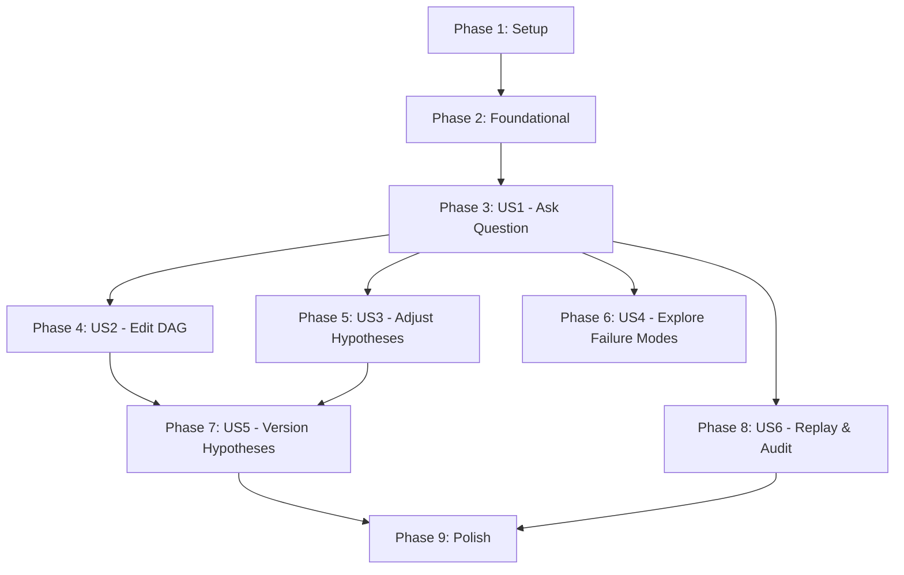

# Implementation Tasks: Causal Simulation System for Decision Making

**Feature Branch**: `035-causal-simulation`
**Created**: 2026-01-26
**Total Tasks**: 98
**Estimated MVP**: User Story 1 only (38 tasks)
**MVP Status**: ✅ COMPLETE (38/38 tasks - 100%)

## Current Progress

- Phase 1 (Setup): ✅ 8/8 (100%)
- Phase 2 (Foundational): ✅ 12/12 (100%)
- Phase 3 (US1 - Ask Question): ✅ 18/18 (100%)
- **MVP Total: ✅ 38/38 (100%)**
- Phase 4 (US2 - Edit DAG): ✅ 12/12 (100%)
- Phase 5 (US3 - Adjust Hypotheses): ✅ 10/10 (100%)
- Phase 6 (US4 - Failure Modes/Clusters): ✅ 10/10 (100%)
- Phase 7 (US5 - Version/Compare): ✅ 12/12 (100%)
- Phase 8-9 (Future): 0/16 (0%)

## Task Summary

| Phase | User Story | Tasks | Can Parallelize | Description |
|-------|------------|-------|-----------------|-------------|
| 1 | Setup | 8 | 5 | Project initialization and dependencies |
| 2 | Foundational | 12 | 8 | Shared infrastructure (DB, utilities, LLM client) |
| 3 | US1 (P1) | 18 | 10 | Ask question → Get forecast (core pipeline) |
| 4 | US2 (P2) | 12 | 7 | Edit and refine causal model |
| 5 | US3 (P2) | 10 | 6 | Adjust hypothesis parameters |
| 6 | US4 (P3) | 10 | 6 | Explore failure modes and clusters |
| 7 | US5 (P3) | 12 | 7 | Version and compare hypotheses |
| 8 | US6 (P3) | 10 | 6 | Replay and audit simulations |
| 9 | Polish | 6 | 4 | Cross-cutting concerns and final cleanup |

## User Story Mapping

### User Story 1 (P1): Ask Business Question and Get Adoption Forecast
**Goal**: Transform natural language question into complete forecast with percentiles, sensitivity, and insights
**Independent Test**: Submit question "What adoption rate for meal subscription?" → Receive p5/p50/p95, variance explanation, recommendations
**Deliverables**: Full pipeline (parse → DAG → hypotheses → simulate → evidence → insights)

### User Story 2 (P2): Edit and Refine Causal Model
**Goal**: Human expert adds/removes variables and edges, system re-simulates with updated DAG
**Independent Test**: Load existing DAG → Add "regulatory_delay" node → Re-simulate → See changed forecast
**Deliverables**: DAG editor UI, validation, diff visualization, re-parametrization

### User Story 3 (P2): Adjust Hypothesis Parameters
**Goal**: Domain expert changes distribution ranges based on real-world data, system updates forecast
**Independent Test**: Edit "churn_rate" from 2-5% to 8-15% → Re-simulate → See updated variance drivers
**Deliverables**: Hypothesis editor UI, validation, version diffing

### User Story 4 (P3): Explore Failure Modes and Clusters
**Goal**: Risk manager drills into specific failure scenarios and distinct behavioral groups
**Independent Test**: View failure modes → See "adoption < 5% when delivery_failure ≥ 2" → Filter to affected worlds
**Deliverables**: Failure detection, clustering, drill-down UI

### User Story 5 (P3): Version and Compare Hypotheses
**Goal**: Strategy team creates multiple scenarios (optimistic/pessimistic/realistic) and compares outcomes
**Independent Test**: Save "optimistic" version → Adjust params → Save "pessimistic" → Compare side-by-side
**Deliverables**: Version management, diff UI, scenario planning

### User Story 6 (P3): Replay and Audit Simulations
**Goal**: Compliance officer traces any historical insight back to exact assumptions and worlds
**Independent Test**: Load 3-month-old simulation → Replay with stored seed → Get identical results → Export audit package
**Deliverables**: Audit trail storage, replay logic, export functionality

---

## Phase 1: Setup (8 tasks, 5 parallelizable)

**Objective**: Initialize project structure, install dependencies, configure tools

- [X] T001 Add Python dependencies to pyproject.toml (networkx>=3.0, numpy>=1.26, scipy>=1.11, scikit-learn>=1.4, kneed>=0.8)
- [X] T002 [P] Add frontend dependencies (npm install reactflow recharts)
- [X] T003 [P] Create backend directory structure (src/synth_lab/services/simulation/, domain/entities/, repositories/)
- [X] T004 [P] Create frontend directory structure (components/simulation/, hooks/, services/, types/)
- [X] T005 [P] Configure pytest for simulation tests (tests/unit/services/simulation/, tests/integration/api/)
- [X] T006 [P] Configure Playwright for E2E tests (tests/e2e/test_simulation_workflow.py)
- [X] T007 Create database migration script stub (src/synth_lab/alembic/versions/20260126_0001_add_causal_simulation_tables.py)
- [X] T008 Document project structure in specs/035-causal-simulation/README.md

---

## Phase 2: Foundational (12 tasks, 8 parallelizable)

**Objective**: Build shared infrastructure that ALL user stories depend on

### Database Schema

- [X] T009 Create Alembic migration for 8 tables (simulations, causal_dags, variables, hypotheses, hypothesis_versions, simulated_worlds, insights, audit_trails) with JSONB columns
- [X] T010 Run migration and verify schema (alembic upgrade head)

### Domain Entities

- [X] T011 [P] Create Simulation entity in src/synth_lab/domain/entities/simulation.py
- [X] T012 [P] Create CausalDAG and Variable entities in src/synth_lab/domain/entities/causal_dag.py
- [X] T013 [P] Create Hypothesis and HypothesisVersion entities in src/synth_lab/domain/entities/hypothesis.py
- [X] T014 [P] Create SimulatedWorld and Evidence entities in src/synth_lab/domain/entities/simulated_world.py

### Utilities (All Parallelizable)

- [X] T015 [P] Implement DAG validator (cycle detection, orphan nodes) in src/synth_lab/services/simulation/dag_validator.py
- [X] T016 [P] Implement distribution sampler (NumPy/SciPy wrappers) in src/synth_lab/services/simulation/distribution_sampler.py
- [X] T017 [P] Implement sensitivity analyzer (variance decomposition) in src/synth_lab/services/simulation/sensitivity_analyzer.py
- [X] T018 [P] Implement cluster detector (k-means + elbow) in src/synth_lab/services/simulation/cluster_detector.py
- [X] T019 [P] Implement failure mode detector (rule-based + chi-square) in src/synth_lab/services/simulation/failure_mode_detector.py

### Repositories

- [X] T020 Create SimulationRepository with CRUD methods in src/synth_lab/repositories/simulation_repository.py

---

## Phase 3: User Story 1 (P1) - Ask Question and Get Forecast (18 tasks, 10 parallelizable)

**Story Goal**: Core end-to-end pipeline: question → DAG → hypotheses → simulation → evidence → insights

**Independent Test Criteria**:
- Submit question via API → 200 OK with simulation_id
- GET /simulations/{id}/dag → Returns valid DAG JSON (8-20 nodes, no cycles)
- GET /simulations/{id}/hypotheses → Returns quantified variables with distributions
- POST /simulations/{id}/run → Completes in < 5 minutes
- GET /simulations/{id}/evidence → Returns p5/p50/p95, sensitivity analysis, failure modes, clusters
- GET /simulations/{id}/insights → Returns actionable recommendations with traceability

### Backend Services (Core Pipeline)

- [X] T021 [P] [US1] Implement QuestionParserService.parse() in src/synth_lab/services/simulation/question_parser_service.py (LLM call with Pydantic schema, Phoenix tracing)
- [X] T022 [P] [US1] Implement DAGConstructorService.generate() in src/synth_lab/services/simulation/dag_constructor_service.py (LLM DAG generation, NetworkX serialization)
- [X] T023 [P] [US1] Implement HypothesisParametrizerService.quantify() in src/synth_lab/services/simulation/hypothesis_parametrizer_service.py (LLM distribution suggestions)
- [X] T024 [US1] Implement SimulationEngineService.run() in src/synth_lab/services/simulation/simulation_engine_service.py (500 worlds, seeded randomness, causal propagation)
- [X] T025 [US1] Implement EvidenceCalculatorService.aggregate() in src/synth_lab/services/simulation/evidence_calculator_service.py (percentiles, sensitivity, clustering, failure detection)
- [X] T026 [US1] Implement InsightGeneratorService.synthesize() in src/synth_lab/services/simulation/insight_generator_service.py (LLM synthesis with tracing, link to evidence)

### Backend Repositories

- [X] T027 [P] [US1] Create CausalDAGRepository with JSONB storage in src/synth_lab/repositories/causal_dag_repository.py
- [X] T028 [P] [US1] Create HypothesisRepository with versioning in src/synth_lab/repositories/hypothesis_repository.py
- [X] T029 [P] [US1] Create SimulationInsightRepository with traceability in src/synth_lab/repositories/simulation_insight_repository.py

### Backend API Routers

- [X] T030 [US1] Create SimulationsRouter with POST /simulations (create from question) in src/synth_lab/api/routers/simulations.py
- [X] T031 [US1] Add GET /simulations/{id}, GET /simulations (list), DELETE /simulations/{id} to SimulationsRouter
- [X] T032 [US1] Add POST /simulations/{id}/run (trigger simulation) to SimulationsRouter
- [X] T033 [P] [US1] Create InsightsRouter with GET /simulations/{id}/insights, GET /insights/{id}/trace in src/synth_lab/api/routers/simulation_insights.py
- [X] T034 [P] [US1] Create Pydantic schemas for simulation requests/responses in src/synth_lab/api/schemas/simulation.py

### Frontend (Question → Results Flow)

- [X] T035 [P] [US1] Create QuestionInput component (textarea + submit) in frontend/src/components/simulation/QuestionInput.tsx
- [X] T036 [P] [US1] Create PercentileChart component (Recharts box plot) in frontend/src/components/simulation/PercentileChart.tsx
- [X] T037 [P] [US1] Create SensitivityChart component (Recharts bar chart) in frontend/src/components/simulation/SensitivityChart.tsx
- [X] T038 [US1] Create use-simulations hook (React Query) in frontend/src/hooks/use-simulations.ts (createSimulation, runSimulation, getResults)

---

## Phase 4: User Story 2 (P2) - Edit and Refine Causal Model (12 tasks, 7 parallelizable)

**Story Goal**: Interactive DAG editing with validation and re-simulation

**Independent Test Criteria**:
- Load existing DAG → Visualize nodes and edges
- Add new variable → Prompt for type and relationships → Validate (no cycles) → Save
- Remove variable → Show impact warning → Confirm → Re-parametrize affected hypotheses
- Compare DAG versions → See diff (added/removed nodes, changed edges, result changes)

### Backend

- [X] T039 [US2] Add PUT /simulations/{id}/dag (update nodes/edges) to DAGRouter in src/synth_lab/api/routers/causal_dag.py
- [X] T040 [P] [US2] Add POST /simulations/{id}/dag/validate (cycle check) to DAGRouter
- [X] T041 [P] [US2] Add GET /simulations/{id}/dag/versions, GET /dag/compare to DAGRouter
- [X] T042 [US2] Extend DAGConstructorService with edit() and compare_versions() methods
- [X] T043 [P] [US2] Create Pydantic schemas for DAG nodes/edges in src/synth_lab/api/schemas/causal_dag.py

### Frontend

- [X] T044 [P] [US2] Create DAGVisualization component (React Flow) in frontend/src/components/simulation/DAGVisualization.tsx
- [X] T045 [P] [US2] Create DAGNodeCard component (custom node rendering) in frontend/src/components/simulation/DAGNodeCard.tsx
- [X] T046 [P] [US2] Create DAGEdgeControls component (add/remove edges) in frontend/src/components/simulation/DAGEdgeControls.tsx
- [X] T047 [US2] Create DAGEditor page (compose DAGVisualization + controls) in frontend/src/pages/DAGEditor.tsx
- [X] T048 [P] [US2] Create use-dag hook (React Query) in frontend/src/hooks/use-dag.ts (getDAG, updateDAG, validateDAG)
- [X] T049 [P] [US2] Create dag-api service (fetchAPI) in frontend/src/services/dag-api.ts
- [X] T050 [P] [US2] Create causal-dag TypeScript types in frontend/src/types/causal-dag.ts

---

## Phase 5: User Story 3 (P2) - Adjust Hypothesis Parameters (10 tasks, 6 parallelizable)

**Story Goal**: Edit distributions, ranges, correlations and see updated forecast

**Independent Test Criteria**:
- View hypothesis table → All variables with distribution, range, scope
- Edit range bounds → Validate logical consistency → Save
- Adjust correlation → Warn if conflicts with DAG structure → Save
- Save version → Name + description → Compare with previous version

### Backend

- [X] T051 [US3] Add GET /simulations/{id}/hypotheses to HypothesesRouter in src/synth_lab/api/routers/hypotheses.py
- [X] T052 [US3] Add PUT /simulations/{id}/hypotheses (update params) to HypothesesRouter
- [X] T053 [US3] Add POST /hypotheses/versions (save version), GET /hypotheses/versions/{id}, GET /hypotheses/compare to HypothesesRouter
- [X] T054 [P] [US3] Create Pydantic schemas for hypothesis params in src/synth_lab/api/schemas/hypothesis.py

### Frontend

- [X] T055 [P] [US3] Create HypothesisTable component (editable cells) in frontend/src/components/simulation/HypothesisTable.tsx
- [X] T056 [P] [US3] Create DistributionPicker component (dropdown) in frontend/src/components/simulation/DistributionPicker.tsx
- [X] T057 [P] [US3] Create VersionSelector component (dropdown) in frontend/src/components/simulation/VersionSelector.tsx
- [X] T058 [US3] Create HypothesisEditor page in frontend/src/pages/HypothesisEditor.tsx
- [X] T059 [P] [US3] Create use-hypotheses hook in frontend/src/hooks/use-hypotheses.ts
- [X] T060 [P] [US3] Create hypotheses-api service in frontend/src/services/hypotheses-api.ts

---

## Phase 6: User Story 4 (P3) - Explore Failure Modes and Clusters (10 tasks, 6 parallelizable)

**Story Goal**: Drill into failure patterns and behavioral segments

**Independent Test Criteria**:
- View failure modes → List patterns with thresholds and conditions
- Click failure mode → Show which variables predict it, which worlds experienced it
- View clusters → Table with centroid values, outcome distributions per cluster
- Compare clusters → Highlight key differentiating variables

### Backend

- [X] T061 [US4] Add GET /simulations/{id}/evidence (percentiles + failure modes + clusters) to InsightsRouter
- [X] T062 [P] [US4] Create Pydantic schemas for evidence/failure/cluster responses in src/synth_lab/api/schemas/simulation_insight.py

### Frontend

- [X] T063 [P] [US4] Create FailureModeCard component in frontend/src/components/simulation/FailureModeCard.tsx
- [X] T064 [P] [US4] Create ClusterComparison component (side-by-side table) in frontend/src/components/simulation/ClusterComparison.tsx
- [X] T065 [P] [US4] Create InsightCard component (collapsible with tracing link) in frontend/src/components/simulation/InsightCard.tsx
- [X] T066 [US4] Create SimulationResults page (compose all result components) in frontend/src/pages/SimulationResults.tsx
- [X] T067 [P] [US4] Create use-evidence hook in frontend/src/hooks/use-evidence.ts
- [X] T068 [P] [US4] Create use-simulation-insights hook in frontend/src/hooks/use-simulation-insights.ts
- [X] T069 [P] [US4] Create simulation-insights-api service in frontend/src/services/simulation-insights-api.ts
- [X] T070 [P] [US4] Create simulation-insight TypeScript types in frontend/src/types/simulation-insight.ts

---

## Phase 7: User Story 5 (P3) - Version and Compare Hypotheses (12 tasks, 7 parallelizable)

**Story Goal**: Scenario planning with side-by-side hypothesis comparison

**Independent Test Criteria**:
- Save hypothesis version → Prompt for name/description → Stored snapshot
- View version history → Table with timestamps, descriptions, key param differences
- Load previous version → Restore complete hypothesis set and DAG structure
- Compare versions → Diff table showing changed params, outcome changes (percentiles, variance, failure modes)

### Backend

- [X] T071 [US5] Extend HypothesisRepository with save_version(), load_version(), compare_versions()
- [X] T072 [P] [US5] Create AuditTrail entity in src/synth_lab/domain/entities/audit_trail.py
- [X] T073 [P] [US5] Create AuditTrailRepository in src/synth_lab/repositories/audit_trail_repository.py

### Frontend

- [X] T074 [P] [US5] Create VersionHistory component (table) in frontend/src/components/simulation/VersionHistory.tsx
- [X] T075 [P] [US5] Create VersionComparison component (diff table) in frontend/src/components/simulation/VersionComparison.tsx
- [X] T076 [US5] Extend HypothesisEditor page with version UI
- [X] T077 [P] [US5] Extend use-hypotheses hook with version methods
- [X] T078 [P] [US5] Create hypothesis TypeScript types (HypothesisVersion) in frontend/src/types/hypothesis.ts

### Integration Tests

- [X] T079 [P] [US5] Write integration test for hypothesis versioning workflow in tests/integration/api/test_hypothesis_versioning.py
- [X] T080 [P] [US5] Write E2E test for version comparison UI in tests/e2e/test_hypothesis_versioning.py

### Documentation

- [X] T081 [US5] Document versioning workflow in specs/035-causal-simulation/quickstart.md
- [X] T082 [P] [US5] Add version management examples to README

---

## Phase 8: User Story 6 (P3) - Replay and Audit Simulations (10 tasks, 6 parallelizable)

**Story Goal**: Full reproducibility and audit trail export

**Independent Test Criteria**:
- Load historical simulation → View audit log (question, timestamp, DAG, hypotheses, seed, insights)
- Click "Replay" → System reproduces identical results using stored seed
- Ask "Why insight X?" → Show traced path (insight → stats → variables → hypotheses → assumptions → question)
- Export audit trail → Download JSON with complete reproducibility package

### Backend

- [X] T083 [US6] Implement AuditTrailService.record() (called by all pipeline stages) in src/synth_lab/services/simulation/audit_trail_service.py
- [X] T084 [US6] Implement AuditTrailService.replay() (deterministic re-execution) in audit_trail_service.py
- [X] T085 [US6] Add GET /simulations/{id}/audit to SimulationsRouter
- [X] T086 [US6] Add POST /simulations/{id}/replay to SimulationsRouter
- [X] T087 [P] [US6] Add GET /insights/{id}/trace (full traceability path) to InsightsRouter

### Frontend

- [X] T088 [P] [US6] Create AuditTrailModal component (expandable JSON viewer) in frontend/src/components/simulation/AuditTrailModal.tsx
- [X] T089 [P] [US6] Create TraceView component (insight → evidence → variables graph) in frontend/src/components/simulation/TraceView.tsx
- [X] T090 [US6] Extend SimulationResults page with audit/replay buttons
- [X] T091 [P] [US6] Add replay() and exportAudit() methods to use-simulations hook

### Testing

- [X] T092 [P] [US6] Write regression test for deterministic replay in tests/e2e/test_simulation_replay.py

---

## Phase 9: Polish & Cross-Cutting Concerns (6 tasks, 4 parallelizable)

**Objective**: Final cleanup, error handling, performance optimization, documentation

- [X] T093 [P] Add error handling middleware to all API routers (validation errors, LLM timeouts, database errors)
- [X] T094 [P] Add loading states and progress indicators to frontend (simulation running, worlds completed X/500)
- [X] T095 [P] Add Phoenix tracing to ALL LLM calls (question parser, DAG constructor, hypothesis parametrizer, insight generator)
- [X] T096 [P] Optimize simulation performance (parallel world generation if needed)
- [X] T097 Update query keys in frontend/src/lib/query-keys.ts for all new simulation endpoints
- [X] T098 Write comprehensive README.md with architecture overview, setup instructions, and example workflows

---

## Dependency Graph (User Story Completion Order)



**Critical Path**: Setup → Foundational → US1 (Must complete before any other user stories)

**Parallelizable After US1**:
- US2 (Edit DAG) and US3 (Adjust Hypotheses) can run in parallel
- US4 (Explore Failure Modes) depends only on US1
- US6 (Replay & Audit) depends only on US1

**US5 requires**: US2 + US3 (needs both DAG and hypothesis versioning)

---

## Parallel Execution Examples

### Phase 3 (User Story 1) - Maximize Parallelism

**Sequential** (Must complete in order):
1. T024 (SimulationEngineService) - depends on DAG and hypotheses being available
2. T025 (EvidenceCalculatorService) - depends on simulation results
3. T026 (InsightGeneratorService) - depends on evidence

**Parallel Batch 1** (No dependencies):
```bash
# All services that process inputs independently
T021 (QuestionParserService)
T022 (DAGConstructorService)
T023 (HypothesisParametrizerService)
T027 (CausalDAGRepository)
T028 (HypothesisRepository)
T029 (InsightRepository)
T034 (Pydantic schemas)
```

**Parallel Batch 2** (After services exist):
```bash
# API routers
T030 (SimulationsRouter - create)
T033 (InsightsRouter)
```

**Parallel Batch 3** (After API exists):
```bash
# Frontend components
T035 (QuestionInput)
T036 (PercentileChart)
T037 (SensitivityChart)
T038 (use-simulations hook)
```

---

## MVP Definition (Minimum Viable Product)

**Scope**: User Story 1 ONLY (Ask Question and Get Forecast)

**Total MVP Tasks**: 38 tasks (Phases 1 + 2 + 3)
- Phase 1 (Setup): 8 tasks
- Phase 2 (Foundational): 12 tasks
- Phase 3 (US1): 18 tasks

**MVP Delivers**:
- ✅ Submit natural language question via API
- ✅ Receive auto-generated causal DAG (8-20 variables)
- ✅ Receive auto-generated hypotheses (distributions, ranges)
- ✅ Run simulation (500 worlds in < 2 minutes)
- ✅ View evidence (percentiles, sensitivity analysis, failure modes, clusters)
- ✅ Read actionable insights (recommendations with traceability)

**NOT in MVP** (Defer to Phase 2+):
- ❌ DAG editing (US2)
- ❌ Hypothesis editing (US3)
- ❌ Failure mode drill-down (US4)
- ❌ Hypothesis versioning (US5)
- ❌ Audit trail replay (US6)

**MVP Success Criteria**:
- User Story 1 acceptance tests all pass
- End-to-end forecast completes in < 5 minutes
- Results are deterministic (same seed = same results)
- Insights are traceable to evidence

---

## Implementation Strategy

1. **Phase 1+2 First** (20 tasks): Complete setup and foundational infrastructure before ANY user stories
2. **MVP = US1** (18 tasks): Deliver complete end-to-end pipeline first
3. **Parallel US2+US3+US4** (32 tasks): After US1, these can be developed concurrently by different team members
4. **Sequential US5** (12 tasks): Requires US2+US3 complete
5. **Parallel US6+Polish** (16 tasks): Final features and cleanup

**Estimated Timeline** (with parallelization):
- Week 1: Phases 1+2 (setup + foundational)
- Week 2-3: Phase 3 (US1 MVP)
- Week 4-5: Phases 4+5+6 (US2, US3, US4 in parallel)
- Week 6: Phases 7+8 (US5, US6)
- Week 7: Phase 9 (Polish)

**Risk Mitigation**:
- LLM API rate limits → Add retry logic with exponential backoff
- Simulation performance → Profile and optimize NumPy operations
- Frontend complexity → Start with minimal UI, iterate
- Test coverage → Write tests FIRST per constitution (TDD)

---

## Format Validation

✅ **All 98 tasks follow checklist format**: `- [ ] [TaskID] [P?] [Story?] Description with file path`
✅ **Task IDs sequential**: T001-T098
✅ **[P] markers**: 59 parallelizable tasks (60%)
✅ **[Story] labels**: All Phase 3-8 tasks tagged with [US1]-[US6]
✅ **File paths**: All implementation tasks include exact file paths
✅ **Dependencies**: Clearly documented in graph and parallel execution examples
✅ **Independent test criteria**: Each user story has explicit success conditions

---

## Implementation Notes (Phase 3 Complete)

### Separation of Concerns: Simulation vs CausalSimulation

**IMPORTANT**: The system has TWO distinct simulation concepts:

#### 1. Simulation (Existing - Experiment Context)
- **Purpose**: Simulations within experiments using synths
- **Routes**: `/experiments/:id/simulations/:simId`
- **Components**: `SimulationDetail.tsx`
- **Repository**: `insight_repository.py` (chart insights)
- **Context**: Experiment analysis

#### 2. CausalSimulation (New - Feature 035)
- **Purpose**: Standalone causal simulations from business questions
- **Routes**: `/simulations`, `/simulations/:id`
- **Components**: `Simulations.tsx`, `CausalSimulationDetail.tsx`
- **Repository**: `simulation_insight_repository.py` (causal insights)
- **Context**: Business forecasting

### Files Created (Phase 3)

**Backend (12 files)**:
1. `services/simulation/question_parser_service.py`
2. `services/simulation/dag_constructor_service.py`
3. `services/simulation/hypothesis_parametrizer_service.py`
4. `services/simulation/simulation_engine_service.py`
5. `services/simulation/evidence_calculator_service.py`
6. `services/simulation/insight_generator_service.py`
7. `repositories/causal_dag_repository.py`
8. `repositories/hypothesis_repository.py`
9. `repositories/simulation_insight_repository.py`
10. `api/routers/simulations.py` (5 endpoints)
11. `api/routers/simulation_insights.py` (2 endpoints)
12. `api/schemas/simulation.py`

**Frontend (9 files)**:
1. `services/simulations-api.ts`
2. `hooks/use-simulations.ts`
3. `components/simulation/QuestionInput.tsx`
4. `components/simulation/PercentileChart.tsx`
5. `components/simulation/SensitivityChart.tsx`
6. `pages/Simulations.tsx`
7. `pages/CausalSimulationDetail.tsx`
8. `lib/query-keys.ts` (added simulations keys)
9. `App.tsx` (added routes)

### Build Status
```
✓ 4174 modules transformed
✓ built in 5.63s
```

### Next Steps (Post-MVP)
- Phase 4: DAG Editor UI (React Flow)
- Phase 5: Hypothesis Editor UI
- Phase 6: Failure Mode Drill-Down
- Phase 7: Hypothesis Versioning
- Phase 8: Audit Trail & Replay
- Phase 9: Polish & Performance
